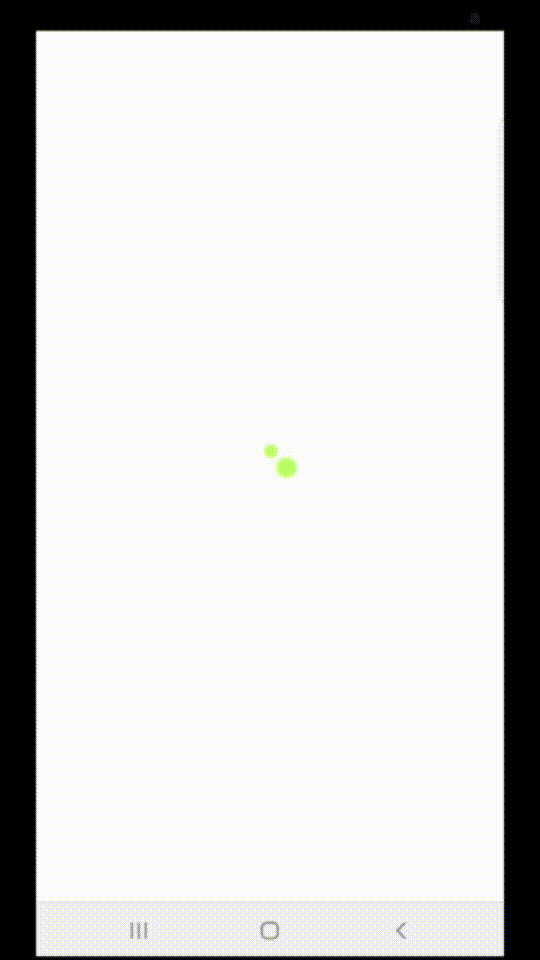

# GreenLight

## Actually, this app is made for Galaxy phone maybe Galaxy note 8.
## But ridiculuously, the designers designed it with iPhone 14's size.
## We are going to modify those non-senses later.

### 1. Set up

> * You must have installed flutter yourself in window, mac or other environments.
> * Also, you must have firebase accounts already. 
> * Finally, you need Firebase CLI throught this web page. https://firebase.google.com/docs/cli?hl=ko#setup_update_cli
> * Run those instructions to attach firebase to your flutter project

```firebase login```

```dart pub global activate flutterfire_cli```

```flutterfire configure```

```flutter pub add firebase_core```

## Make sure that your firestore structure must follow ours if you want to run this app without amendings.

### 2. Firebase Services

> * Authentication - Email & Password
> * Firestore - our database
> * Storage - red_lights/{uid_timestamp} photo files

Here are several tables for our database.


------------------------------

------------------------------


### 3. Branches

> * main - comprehensive outputs
> * Yu - design to dart files
> * map - focused on map and feed 
> * sm - focused on home and group

### 4. Descriptions of Core files

ㅡㅡ models

ㅡㅡㅡㅡ map.dart, user.dart: each file is a custom data structure.

##### Some of device/emulator descerted files are have certain issues.
##### Such as a getting location issue, a pedometer sensor issue. 

ㅡㅡ screens/home

ㅡㅡㅡㅡ homeview_for_device.dart: provide comprehensive data for users

ㅡㅡㅡㅡ feedview.dart: provide news and others users' activities

ㅡㅡㅡㅡ mapview_for_device.dart: provide user's current location on map, red/greenlight markers, on camera actions

ㅡㅡㅡㅡ groupview.dart: ~~~~~~~


### 5. Actual app running shots

##### Overall components of the app.


##### Getting an information of a red light on Home view.


##### Making a red light to a green light activity on the map.


##### The output of filling in the form.


